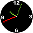
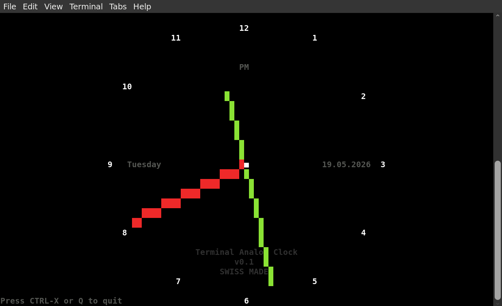
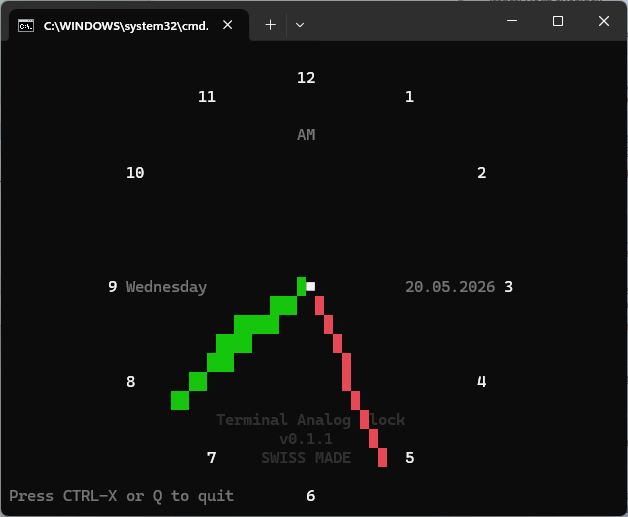

# Terminal Analog Clock

> ❝ an analog clock for the terminal ❞

  
*analog clock icon*

## Screenshots 📷

As usual, just a little teaser:

  
*Linux Screenshot*

  
*Windows 11 Screenshot (well, 07:37 is not the best time for taking a nice screenshot)*

## Preface and history 📜

As a clock lover, coming from a clock-making country and because I did not find any decent analog clock for the terminal, I decided to programm one. After realizing that it is really not that simple to draw beautiful lines in the terminal *(not using sixel or kitty protocol)*, I came with a first solution that had somewhat antialiased but ugly, wide and nonreadable clockface-hands. After a second trial, I found the [Bresenham line algorithm](https://en.wikipedia.org/wiki/Bresenham%27s_line_algorithm) and even managed to proper antialias it. The culprit was: It was blurry, chunky and was not looking crisp as I had expected. I guess that in the terminal, my eyes are trained to see pure non graphical information. Well then.

My conclusion after all that messing around is, that using the Bresenham algo is fine (of course it is!) but antialiasing is not. So I can keep the code quite a bit smaller. Is it beautiful? Alas! Probably not - but hopefully *useful* at least.

## Installation 📦

### Linux installation 🐧

* Run `sudo apt install python3` for Debian. Installation for other distributions may vary. There is no other dependencies.
* run `./analogclock.py` to start the calculator 🚀
* to install it permanently including a man page, run
  * `apt install pandoc`
  * `make`
  * `sudo make install`
* to uninstall it, run `sudo make uninstall`

### Windows installation 🪟️

* install [python](https://www.python.org/downloads/windows/) (Tested with Windows 11 only)
* use `run.bat` to start the calculator or open a cmd-shell and execute `py ./analogclock.py` 🚀

## Usage 💡

### Disclaimer ⚠️

Don't use this clock if you plan to fly to the moon. I'm not kidding — expect that something might go wrong. Testing all edge cases is not simple.

### General Usage 👇

* Just run `./analogclock.py` in the path you have downloaded it or simply run `analogclock` if you have installed it.
* Other colors can be configured in the source code at the section `# CONFIGURATION`

### Hotkeys ⌨️

These are the only hotkeys needed:

* CTRL-X → exit   *or*
* Q → exit

**Hint:** If a hotkey is not working, this is most likely due to the terminal shell in use and it's predefined hotkeys.

### To Do's and Niceties for coming versions 🚧

* implement kitty protocol to get a beautiful clock finally.
* integrate digital Stopwatch, Timer, Countdown
* Draw a real clockface - would it be an option to draw a square or even rectangular clockface?
* draw larger clockfacenumbers if terminalsize is \> 30 lines
* use sixel or kitty protocol?

## Error reporting 🐛

* Errors and bugs are possibly included.
* Error reports, corrections or kind words are welcome: ✉️  [sery&#x40;solnet.ch](mailto:sery&#x40;solnet.ch)

> manufactured with ♥ in Switzerland

## see also

**date**(1), **cal**(1), **aclock**(1)
